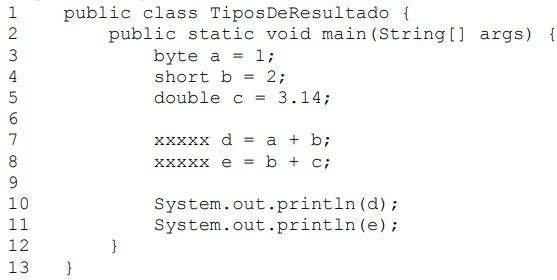

# Lista de Exercicios 3
Esta lista contém exercicios para o treinamento de conceitos relacionados a operadores na linguagem Java, como operações aritméticas, operações relacionais, operações lógicas, operações ternárias, incremento e decremento, limites de valores de variáveis e conversão de variáveis.
## Enunciados
1 - Crie um arquivo chamado ConversaoPrimitivos.java. Para eliminar os erros de compilação, complete os espaços marcados por “xxxxx” do código abaixo quando necessário.

2 - Crie um arquivo chamado Casting.java. Crie uma variável chamada numero1 do tipo long e inicialize-a com o valor 2147483648L. Depois, crie uma variável chamada numero2 do tipo int e copie o valor da variável numero1 para a variável numero2. Por fim, exiba, na saída padrão, os valores dessas duas variáveis.

3 - Crie um arquivo chamado Conversao.java. Crie uma variável chamada texto do tipo String e associe a ela a sequência de caracteres "19.09". Depois, faça a conversão do valor associado a essa variável para double e armazene o resultado em uma variável chamada numero do tipo double. Por fim, exiba o valor da variável numero.

4 - Crie um arquivo chamado OperadoresAritmeticos.java. Complete o código a seguir no local indicado por “xxxxx”, com os operadores aritméticos da linguagem Java. Não utilize operadores repetidos. O programa deve exibir os números 11, 8, 60, 5 e 2 nessa ordem.

5 - Crie um arquivo chamado TiposDeResultado.java. Complete o código a seguir, substituindo a
seqüência “xxxxx” com os tipos primitivos numéricos da linguagem Java. Utilize sempre o tipo que
ocupa o menor espaço na memória.

6 - Crie um arquivo chamado DivisaoInteiraReal.java. Complete o código, substituindo a seqüência “xxxxx” com operações de divisão, operações de casting e parênteses. O programa deve exibir os números 2, 2.5, 2.5, 2.5 e 2.0 nessa ordem. A cada linha complete o código de uma forma diferente. Não é necessário completar todas as seqüências.

7 - Crie um arquivo chamado OverflowUnderflow.java. Complete o código, substituindo a seqüência “xxxxx” com valores literais. O programa deve exibir os números -2147483648 e 2147483647 nessa ordem.

8 - Crie um arquivo chamado Concatenacao.java. Complete o código, substituindo a seqüência “xxxxx” com operações de concatenação e parênteses. O programa deve exibir as mensagens "Java123", "Java6", "123Java" e "6Java" nessa ordem. Não é necessário completar todas as seqüências.

9 - Crie um arquivo chamado OperadoresDeAtribuicao.java. Complete o código, substituindo a seqüência “xxxxx” com operações de atribuição. O programa deve exibir os valores 1, 3, 2, 6, 3, 1, 2 e 1 nessa ordem. Não utilize o mesmo operador duas ou mais vezes.

10 - Crie um arquivo chamado OperadoresRelacionais.java. Complete o código, substituindo a seqüência “xxxxx” com operações de comparação. O programa deve exibir os valores false, false, true, true, false e true nessa ordem. Não utilize o mesmo operador duas ou mais vezes.

11 - Crie um arquivo chamado OperadoresLogicos.java. Complete o código, substituindo a seqüência “xxxxx” com operações lógicas. O programa deve exibir os valores true, true, false, false e true nessa ordem. Não utilize o mesmo operador duas ou mais vezes.

12 - Crie um arquivo chamado OperadorTernario.java. Complete o código, substituindo a seqüência “xxxxx” com o operador ternário. O programa deve exibir a mensagem a < b quando o valor da variável a for menor do que o valor da variável b e a >= b caso contrário.

13 - Crie um arquivo chamado OperadorNegacao.java. Complete o código, substituindo a seqüência “xxxxx” com o operador de negação e parênteses. O programa deve exibir os valores true e false nessa ordem. Não é necessário preencher todas as seqüências.

14 - Crie um arquivo chamado PrePosIncrementoDecremento.java. Complete o código, substituindo a seqüência “xxxxx” com os operadores de incremento e decremento. O programa deve exibir os valores 1, 3, 3 e 1 nessa ordem. Não é necessário preencher todas as seqüências.

