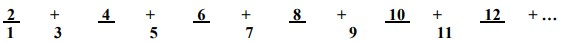
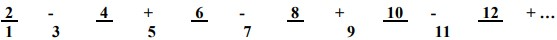
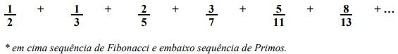
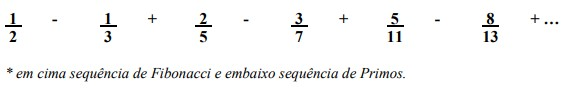
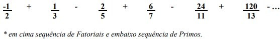

# 6ª Lista de Exercícios
Esta lista contém exercícios para o treinamento de conceitos relacionados a laços de repetição na linguagem Java, como as estruturas cíclicas while, do/while e for, variáveis de incremento e diversas aplicações destes conceitos, como criação de sequências de Fibonacci, de Ricci, de números primos, de números perfeitos etc.
## Enunciados
1) Escreva um programa em Java para imprimir os números de 1 (inclusive) a 10 (inclusive) em ordem crescente.

2) Escreva um programa em Java para imprimir os números de 1 (inclusive) a 10 (inclusive) em ordem decrescente.

3) Escreva um programa em Java para imprimir os 10 primeiros números inteiros maiores que 100.

4) Escreva um programa em Java para ler um valor N e imprimir todos os valores inteiros entre 1 (inclusive) e N (inclusive). Considere que o N será sempre maior que ZERO.

5) Modifique o exercício anterior para aceitar somente valores maiores que 0 para N. Caso o valor informado (para N) não seja maior que 0, deverá ser lido um novo valor para N.

6) Escreva um programa em Java que calcule e imprima a tabuada do 8 (1 a 10).

7) Escreva um programa em Java para ler um valor inteiro (aceitar somente valores entre 1 e 10) e escrever a tabuada de 1 a 10 do valor lido.

8) Escreva um programa em Java para ler 10 valores e escrever quantos desses valores lidos são NEGATIVOS.

9) Escreva um programa em Java para ler 10 valores e escrever quantos desses valores lidos estão no intervalo [10,20] (incluindo os valores 10 e 20 no intervalo) e quantos deles estão fora deste intervalo.

10) Escreva um programa em Java para ler 10 valores, calcular e escrever a média aritmética desses valores lidos.

11) Escreva um programa em Java para ler o número de alunos existentes em uma turma e, após isto, ler as notas destes alunos, calcular e escrever a média aritmética dessas notas lidas.

12) Escreva um programa em Java para ler 10 números e ao final da leitura escrever a soma total dos 10 números lidos.

13) Escreva um programa em Java para ler 10 números. Todos os números lidos com valor inferior a 40 devem ser somados. Escreva o valor final da soma efetuada.

14) Escreva um programa em Java para ler 2 valores, calcular e escrever a soma dos inteiros existentes entre os 2 valores lidos (incluindo os valores lidos na soma). Considere que o segundo valor lido será sempre maior que o primeiro valor lido.

15) O mesmo exercício anterior, mas agora, considere que o segundo valor lido poderá ser maior ou menor que o primeiro valor lido, ou seja, deve-se testá-los.

16) Escreva um programa em Java que calcule e escreva a média aritmética dos números inteiros entre 15 (inclusive) e 100 (inclusive).

17) Escreva um programa em Java para ler as notas da 1a. e 2a. avaliações de um aluno, calcule e imprima a média (simples) desse aluno. Só devem ser aceitos valores válidos durante a leitura (0 a 10) para cada nota. Ao final da execução a mensagem 'NOVO CÁLCULO (S/N)?' deve ser apresentada. Se for respondido 'S' deve retornar e executar um novo cálculo, caso contrário deverá encerrar o programa.

18) Uma loja está levantando o valor total de todas as mercadorias em estoque. Escreva um programa em Java que permita a entrada das seguintes informações: a) o número total de mercadorias no estoque; b) o valor de cada mercadoria. Ao final imprimir o valor total em estoque e a média de valor das mercadorias.

19) O mesmo exercício anterior, mas agora não será informado o número de mercadorias em estoque. Então o funcionamento deverá ser da seguinte forma: ler o valor da mercadoria e perguntar ‘MAIS MERCADORIAS (S/N)?’. Ao final, imprimir o valor total em estoque e a média de valor das mercadorias em estoque.

20) Escreva um programa em Java que leia 100 valores e no final, escreva o maior e o menor valor lido.

21) Escreva um programa em Java para ler uma quantidade e a seguir ler esta quantidade de números. Depois de ler todos os números o algoritmo deve apresentar na tela o maior dos números lidos e a média dos números lidos.

22) Escreva um programa em Java para ler o código e o preço de 15 produtos, calcular e escrever:
- o maior preço lido;
- a média aritmética dos preços dos produtos.

23) A prefeitura de uma cidade deseja fazer uma pesquisa entre seus habitantes. Escreva um programa em Java para coletar dados sobre o salário e número de filhos de cada habitante e após as leituras, escrever:

a) Média de salário da população;

b) Média do número de filhos;

c) Maior salário dos habitantes;

d) Percentual de pessoas com salário menor que R$ 150,00.

Obs.: O final das leituras dos dados se dará com a entrada de um “salário negativo”.

24) Escreva um programa em Java que imprima a tabuada do 1 ao 10, para os números de 0 a 10.

25) Escreva um programa em Java que imprima sequência 1:

1, 1 2 3 4 5 6 7 8 9 10

2, 1 2 3 4 5 6 7 8 9 10

3, 1 2 3 4 5 6 7 8 9 10

4, 1 2 3 4 5 6 7 8 9 10

5, 1 2 3 4 5 6 7 8 9 10

6, 1 2 3 4 5 6 7 8 9 10

7, 1 2 3 4 5 6 7 8 9 10

8, 1 2 3 4 5 6 7 8 9 10

9, 1 2 3 4 5 6 7 8 9 10

10, 1 2 3 4 5 6 7 8 9 10

26) Escreva um programa em Java que imprima sequência 2:

1, 1

2, 1 2

3, 1 2 3

4, 1 2 3 4

5, 1 2 3 4 5

6, 1 2 3 4 5 6

7, 1 2 3 4 5 6 7

8, 1 2 3 4 5 6 7 8

9, 1 2 3 4 5 6 7 8 9

10, 1 2 3 4 5 6 7 8 9 10

27) Escreva um programa em Java que imprima sequência 3:

1, 1 2 3 4 5 6 7 8 9 10

2, 1 2 3 4 5 6 7 8 9

3, 1 2 3 4 5 6 7 8

4, 1 2 3 4 5 6 7

5, 1 2 3 4 5 6

6, 1 2 3 4 5

7, 1 2 3 4

8, 1 2 3

9, 1 2

10, 1

28) Escreva um programa em Java que imprima sequência 4:

1, 2 3 4 5 6 7 8 9 10

2, 3 4 5 6 7 8 9 10

3, 4 5 6 7 8 9 10

4, 5 6 7 8 9 10

5, 6 7 8 9 10

6, 7 8 9 10

7, 8 9 10

8, 9 10

9, 10

10,

29) Escreva um programa em Java que imprima sequência 5:

1, 1 3 5 7 9

2, 2 4 6 8 10

3, 1 3 5 7 9

4, 2 4 6 8 10

5, 1 3 5 7 9

6, 2 4 6 8 10

7, 1 3 5 7 9

8, 2 4 6 8 10

9, 1 3 5 7 9

10, 2 4 6 8 10

30) Escreva um programa em Java que imprima sequência 6:

1, 1

2, 2 4

3, 1 3 5

4, 2 4 6 8

5, 1 3 5 7 9

6, 2 4 6 8 10 12

7, 1 3 5 7 9 11 13

8, 2 4 6 8 10 12 14 16

9, 1 3 5 7 9 11 13 15 17

10, 2 4 6 8 10 12 14 16 18 20
### Sequências de números, usando apenas um laço.
Para solucionar os próximos exercícios, DEVE ser utilizado apenas um laço, podendo, este ser qualquer tipo de laço!

31) Escreva um programa que solicite ao usuário a quantidade de termos, validando a entrada, sendo o valor negativo, solicitar nova entrada, sendo o valor ZERO, finalizar o programa, caso seja positivo imprimir a sequência de termos: 1, 2, 3, 4, ...

32) Escreva um programa que solicite ao usuário a quantidade de termos, validando a entrada, sendo o valor negativo, solicitar nova entrada, sendo o valor ZERO, finalizar o programa, caso seja positivo imprimir a sequência de termos: 0, 2, 4, 6, ...

33) Escreva um programa que solicite ao usuário a quantidade de termos, validando a entrada, sendo o valor negativo, solicitar nova entrada, sendo o valor ZERO, finalizar o programa, caso seja positivo imprimir a sequência de termos: 1, 3, 5, 7, ...

34) Escreva um programa que solicite ao usuário a quantidade de termos, validando a entrada, sendo o valor negativo, solicitar nova entrada, sendo o valor ZERO, finalizar o programa, caso seja positivo imprimir a sequência de termos: 0, 1, 3, 6, 10, 15, ...

35) Escreva um programa que solicite ao usuário a quantidade de termos, validando a entrada, sendo o valor negativo, solicitar nova entrada, sendo o valor ZERO, finalizar o programa, caso seja positivo imprimir a sequência de termos: 1, -1, 2, -2, 3, -3, ...

36) Escreva um programa que solicite ao usuário a quantidade de termos, validando a entrada, sendo o valor negativo, solicitar nova entrada, sendo o valor ZERO, finalizar o programa, caso seja positivo imprimir a sequência de termos: 1, 1/2, 1/3, 1/4, 1/5, ...

37) Escreva um programa que solicite ao usuário a quantidade de termos, validando a entrada, sendo o valor negativo, solicitar nova entrada, sendo o valor ZERO, finalizar o programa, caso seja positivo imprimir a sequência de termos: 1, 1/2, 2/3, 3/4, 4/5, ...

38) Escreva um programa que solicite ao usuário a quantidade de termos, validando a entrada, sendo o valor negativo, solicitar nova entrada, sendo o valor ZERO, finalizar o programa, caso seja positivo imprimir a sequência de termos: 0 (0/1), 1/2, 2/3, 3/4, 4/5, ...

39) Escreva um programa que solicite ao usuário a quantidade de termos, validando a entrada, sendo o valor negativo, solicitar nova entrada, sendo o valor ZERO, finalizar o programa, caso seja positivo imprimir a sequência de termos: 1/50 + 2/49, 3/48 + ... + 50/1. Exemplo com entrada de 50 termos. Apresentar a soma desta sequência no final.

40) Escreva um programa que solicite ao usuário a quantidade de termos, validando a entrada, sendo o valor negativo, solicitar nova entrada, sendo o valor ZERO, finalizar o programa, caso seja positivo imprimir a sequência de termos: 1, 2, 3, ..., 10, 10, 9, 8, ..., 1. Exemplo com entrada de 20 termos.
### Sequências numéricas famosas!
Utilizando seus conhecimentos de programação em estruturas de decisão e laços de repetição, elabore as soluções para os itens abaixo. Podem ser feitos todos em um único arquivo ou um arquivo para cada item, a escolha é livre.
#### a. Fatorial de um número:
Na matemática, o fatorial de um número natural n, representado por n!, é o produto de todos os inteiros positivos menores ou iguais a n. A notação n! foi introduzida por Christian Kramp em 1808. Por definição 0! é igual a 1. A sequência dos fatoriais para n = 0, 1, 2, ... começa com: 1, 1, 2, 6, 24, 120, 720, 5040, 40320, 362880, 3628800, ...

Exemplo do cálculo de números fatoriais:

1! → 1

2! → 2 * 1 = 2

3! → 3 * 2 * 1 = 6

4! → 4 * 3 * 2 * 1 = 24

5! → 5 * 4 * 3 * 2 * 1 = 120

41) Solicite ao usuário um número e mostre o fatorial do número informado.

42) Construa um programa para mostrar o fatorial dos números inteiros na faixa de 1 a 10.

43) Solicite ao usuário 7 números inteiros e para cada leitura informar o fatorial desse número.

44) Solicite ao usuário a quantidade de termos da sequência de fatoriais e imprima o resultado.

45) Solicite ao usuário a quantidade de termos da sequência de fatoriais e imprima a sequência do final para o início.
#### b. Números Primos:
Um número inteiro primo tem exatamente dois divisores naturais distintos: o número 1 e ele mesmo. Por definição, 0, 1 e -1 não são números primos. A propriedade de um número inteiro ser um primo é chamada "primalidade", e a palavra "primo" também é utilizada como substantivo ou adjetivo, se um número inteiro tem módulo maior que um e não é primo, diz-se que é composto (0, 1 e -1 também não são compostos). Como "dois" é o único número primo par, o termo "primo ímpar" refere-se a todo primo maior do que dois. Existem 168 números primos positivos menores do que 1000. São eles: 2, 3, 5, 7, 11, 13, 17, 19, 23, 29, 31, 37, 41, 43, 47, 53, 59, 61, 67, 71, 73, 79, 83, 89, 97, 101, 103, 107, 109, 113, 127, 131, 137, 139, 149, 151, 157, 163, 167, 173, 179, 181, 191, 193, 197, 199, 211, 223, 227, 229, 233, 239, 241, 251, 257, 263, 269, 271, 277, 281, 283, 293, 307, 311, 313, 317, 331, 337, 347, 349, 353, 359, 367, 373, 379, 383, 389, 397, 401, 409, 419, 421, 431, 433, 439, 443, 449, 457, 461, 463, 467, 479, 487, 491, 499, 503, 509, 521, 523, 541, 547, 557, 563, 569, 571, 577, 587, 593, 599, 601, 607, 613, 617, 619, 631, 641, 643, 647, 653, 659, 661, 673, 677, 683, 691, 701, 709, 719, 727, 733, 739, 743, 751, 757, 761, 769, 773, 787, 797, 809, 811, 821, 823, 827, 829, 839, 853, 857, 859, 863, 877, 881, 883, 887, 907, 911, 919, 929, 937, 941, 947, 953, 967, 971, 977, 983, 991 e 997.

46) Solicite ao usuário um número e verifique se este número é primo ou não.

47)Imprima somente os números primos existentes na faixa de um 1 até 100.

48) Solicite ao usuário a quantidade de termos da sequência de números primos e imprima o resultado.

49) Solicite ao usuário a quantidade de termos da sequência de números primos e imprima a sequência do final para o início.

50) Solicite ao usuário o termo inicial e a quantidade de termos da sequência de números primos e imprima o resultado.
#### c. Número de Fibonacci:
A sucessão de Fibonacci ou sequência de Fibonacci é uma sequência de números naturais, na qual os primeiros dois termos são 0 e 1, e cada termo subsequente corresponde à soma dos dois precedentes. A sequência tem o nome do matemático pisano do século XIII Leonardo de Pisa, conhecido como Leonardo Fibonacci, e os termos da sequência são chamados números de Fibonacci. Os números de Fibonacci são, portanto, os números que compõem a seguinte sequência de números inteiros: 0, 1, 1, 2, 3, 5, 8, 13, 21, 34, 55, 89, 144, …

51) Solicite ao usuário a quantidade de termos da sequência de Fibonacci e imprima o resultado.

52) Solicite um número inteiro ao usuário e informe se ele pertence a sequência de Fibonacci ou não.

53) Imprima os números da sequência de Fibonacci que estão presentes na faixa de 1 até 250.

54) Solicite ao usuário o termo inicial e o termo final da sequência de Fibonacci (intervalo fechado) e imprima o resultado.

Ex:

Sequência de Fibonacci → 0, 1, 1, 2, 3, 5, 8, 13, 21, 34, 55, 89, …

Termo inicial → 4

Termo final → 8

Saída → 2, 3, 5, 8, 13
#### d. Números perfeitos:
Em Matemática, um número perfeito é um número inteiro para o qual a soma de todos os seus divisores positivos próprios (excluindo ele mesmo) é igual ao próprio número. Por exemplo, o número 6 é um número perfeito, pois: 6 = 1 + 2 + 3. O próximo número perfeito é o 28, pois: 28 = 1 + 2 + 4 + 7 + 14. Todo número perfeito é um número triangular, bem como um número hexagonal. Temos os seguintes números na sequência de números perfeitos: 6, 28, 496, 8.128, 33.550.336, 8.589.869.056, …

55) Solicite um número inteiro ao usuário e informe se o número é perfeito ou não.

56)Imprima os números perfeitos na faixa de 1 a 900.

57) Solicite ao usuário a quantidade de termos da sequência de números perfeitos e imprima o resultado. (Atenção! Este processamento pode demorar MUITO)
#### e. Sequência de Ricci:
A sequência de Ricci difere da de Fibonacci porque os dois primeiros termos são fornecidos pelo usuário. Os demais termos são gerados da mesma forma que a série de Fibonacci.

58) Solicite ao usuário os dois primeiros termos da sequência de Ricci e gere os 10 próximos termos.

59) Solicite ao usuário os dois primeiros termos da sequência de Ricci e depois solicite a quantidade de termos que ele deseja gerar. Imprimir o resultado.

60) Solicite ao usuário os dois primeiros termos da sequência de Ricci e depois solicite a número e verifique se o número informado pertence a sequência de Ricci ou não.

### Misturando tudo e mais um pouco!

61) Solicite ao usuário a quantidade de termos que ele deseja e imprima a sequência abaixo e a soma dos termos.

62) Solicite ao usuário a quantidade de termos que ele deseja e imprima a sequência abaixo e a soma dos termos.

63) Solicite ao usuário a quantidade de termos que ele deseja e imprima a sequência abaixo e a soma dos termos.

64) Solicite ao usuário a quantidade de termos que ele deseja e imprima a sequência abaixo e a soma dos termos.

65) Solicite ao usuário a quantidade de termos que ele deseja e imprima a sequência abaixo e a soma dos termos.

